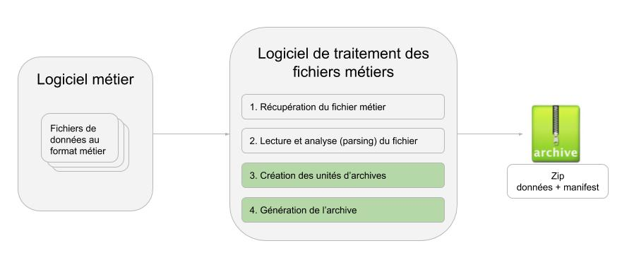

# SipG

## Présentation
* SipG est une bibliothèque pour générer et valider des archives aux formats FNTC v4 et SEDA v2.1 & v2.2.

## Fonctionnalités

La librairie SipG offre les fonctionnalités suivantes : 

* Génération d’un SIP conforme aux formats FNTC v4 et SEDA v2.1, v2.2 & v2.3
* Suivi précis des étapes de validation par callback 
* Validation optionnelle du fichier de description de l'archive par un profil RNG 
* Application automatique de valeurs par défaut raisonnables
* Support des tags et des fragments XML étendus
* Identification des formats des objets binaires (intégration de la librairie Droid)
* Calcul automatique des empreintes des objets binaires
* Support des archives numériques et physiques
* Validation complète d'une archive existante aux formats FNTC v4 ou SEDA v2.1, v2.2 & v2.3
* Sérialisation/désérialisation du fichier de description au format JSON
* Capacité à générer des archives extrêmement volumineuses (plus de 100 000 objets)
* Support du multi-threads lors de la génération de l'archive
* Documentation Javadoc exhaustive 

## Format SEDA v2

Le standard d'échange de données pour l'archivage SEDA modélise les différentes transactions qui peuvent avoir 
lieu entre des  acteurs dans le cadre de l'archivage de données. 

La documentation complète du SEDA v2 est disponible sur le site de [France Archive](https://redirect.francearchives.fr/seda/).

## Format FNTC v4

Le standard FNTC v4 est un standard d'échange de données élaboré dans le cadre de la [FNTC](https://fntc-numerique.com/fr/accueil.html).

Le standard FNTC v4 a pour principales caractéristiques :
* Compatibilité avec les normes [MEDONA & DEPIP](https://www.archimag.com/archives-patrimoine/2018/04/19/depip-norme-nf-iso-20614-protocole-echange-donnees-interoperabilite) supportées par le [SIAF](https://siaf.hypotheses.org/806) 
* Proximité syntaxique et sémantique avec le standard SEDA 2.1
* Syntaxe non ambigüe en regard du XSD 1.0
* Ontologie de description des unités d'archives réduite et simple
* Extension de l’ontologie autorisée dans un cadre bien défini

Les principales différences entre les formats SEDA v2 et FNTC v4 sont [listées ici](https://github.com/Xelians/sipg/blob/master/doc/assets/Diff_SEDA.md). 

## Architecture fonctionnelle
 
La librairie SipG a pour objectif de faciliter la création et la validation d'archives. Dans un premier temps, l'application de traitement des archives récupère et transforme les données métiers, puis grâce à SipG, génère et valide les SIP (Submission Information Package) dans un format compatible avec celui du système d'archivage.



## Exemples 

Le répertoire contenant les tests d'intégration fournit de nombreux exemples d'utilisation de la librairie.

### Sélection de la version du service SEDA v2

SipG supporte les versions 2.1, 2.2 et 2.3 de la norme SEDA. 

```
Sedav2Service service21 = Sedav2Service.getInstance(); // Seda 2.1
Sedav2Service service22 = Sedav2Service.getV22Instance(); // Seda 2.2
Sedav2Service service23 = Sedav2Service.getV23Instance(); // Seda 2.3
```

### Création d’une archive SEDA

```
ArchiveUnit unit = new ArchiveUnit();                    // Instancie l’unité d’archive
unit.setBinaryPath(Paths.get("dummy.pdf"));              // Spécifie le fichier de données
unit.addTitle("MyTitle");                                // Spécifie un titre
unit.addTag("This is a tag");                            // Spécifie un mot clé

ArchiveTransfer archiveTransfer = new ArchiveTransfer();          // Instancie l’archive à transférer
archiveTransfer.setArchivalAgreement("My Archival Agreement");    // Spécifie le contrat 
archiveTransfer.setArchivalAgency("AG001", "");                   // Spécifie le service d’archive
archiveTransfer.setTransferringAgency("AG002", "");               // Spécifie le service versant
archiveTransfer.addArchiveUnit(unit);                             // Ajoute l’unité à l’archive

Sedav2Service.getInstance().write(archiveTransfer, Paths.get("seda.zip"));  // Génère le SIP en Seda v2.1
Sedav2Service.getV22Instance().write(archiveTransfer, Paths.get("seda.zip"));  // Génère le SIP en Seda v2.2
Sedav2Service.getV23Instance().write(archiveTransfer, Paths.get("seda.zip"));  // Génère le SIP en Seda v2.3
```

### Création d’une archive au format SEDA à partir d'un fichier CSV

Fichier CSV :
```
dummy.pdf;MyTitle1;tag1
dummy.pdf;MyTitle2;tag2
dummy.pdf;MyTitle3;tag3
dummy.pdf;MyTitle4;tag4
dummy.pdf;MyTitle5;tag5
```
Code :
```
ArchiveTransfer archiveTransfer = new ArchiveTransfer();                   // Instancie l’archive
archiveTransfer.setArchivalAgreement("My Agreement");
archiveTransfer.setArchivalAgency("AG001", "My Archive Agency");
archiveTransfer.setTransferringAgency("AG002", "My Transfer Agency");

try (BufferedReader reader = Files.newBufferedReader(csvPath)) {           // Ouvre le fichier CSV
   CSVParser parser = CSVFormat.DEFAULT.withDelimiter(';').parse(reader);  // Instancie le parser CSV
   for (CSVRecord record : parser) {                                       // Parcours le fichier CSV
       ArchiveUnit unit = new ArchiveUnit();                               // Une archive peut contenir   
       unit.setBinaryPath(Paths.get(record.get(0)));                       // plusieurs unités d'archives 
       unit.addTitle(record.get(1));
       unit.addTag(record.get(2));
       archiveTransfer.addArchiveUnit(unit);                               // Ajout de l'unité à l'archive
   }
}
Sedav2Service.getInstance().write(archiveTransfer, Paths.get("seda.zip"));  // Génère le SIP
```

### Validation d'un fichier XML au format SEDA

```
Path path = Paths.get("seda_small.xml");               // Le fichier XML à valider
Sedav2Service.getInstance().validate(path);            // Validation du fichier en Seda v2.1
Sedav2Service.getV22Instance().validate(path);            // Validation du fichier en Seda v2.2
```

### Validation d'un fichier XML selon un profil RNG

```
Path path = Paths.get("seda_small.xml");               // Le fichier XML à valider
Path rngPath = Paths.get("seda_small.rng");            // Le profil RNG
Validator rng = Validators.getRngValidator(rngPath);   // Création d'un validator RNG
Validators.validate(path, rng);                        // Validation du fichier avec le validateur
```

### Validation complète (structure & xml) avec callback d'une archive au format SEDA

Code :
```
Path input = Paths.get("seda.zip");                    // Archive à valider
Sedav2Config cnf = Sedav2Config.DEFAULT;               // Configuration pour contrôler la validation
Validator val = null;                                  // Validation RNG optionnelle

Sedav2Service.getInstance().validate(input, val, cnf, event -> LOGGER.info(event.toString()));
```

Résultat de la validation :
```
ProgressEvent{id=seda, status=SUCCESS, step=START, message=Archive: seda.zip}
ProgressEvent{id=seda, status=SUCCESS, step=ARCHIVE_EXIST, message=Archive exists}
ProgressEvent{id=seda, status=SUCCESS, step=ARCHIVE_READABLE, message=Archive is readable}
ProgressEvent{id=seda, status=SUCCESS, step=ARCHIVE_UNZIP, message=Archive is opened}
ProgressEvent{id=seda, status=SUCCESS, step=MANIFEST_EXIST, message=Manifest exists}
ProgressEvent{id=seda, status=SUCCESS, step=MANIFEST_SEDA, message=Manifest conforms to SEDA}
ProgressEvent{id=seda, status=SUCCESS, step=MANIFEST_PARSE, message=Manifest is parsed}
ProgressEvent{id=seda, status=SUCCESS, step=BINARY_EXIST, message=Binary object exists: Content/helloworld_1.pdf}
ProgressEvent{id=seda, status=SUCCESS, step=BINARY_FOLDER, message=Binary object folder is valid}
ProgressEvent{id=seda, status=SUCCESS, step=BINARY_SIZE, message=Binary object size is valid}
ProgressEvent{id=seda, status=SUCCESS, step=BINARY_DIGEST, message=Binary object digest is valid}
ProgressEvent{id=seda, status=SUCCESS, step=BINARY_EXIST, message=Binary object exists: Content/helloworld_2.pdf}
ProgressEvent{id=seda, status=SUCCESS, step=BINARY_FOLDER, message=Binary object folder is valid}
ProgressEvent{id=seda, status=SUCCESS, step=BINARY_SIZE, message=Binary object size is valid}
ProgressEvent{id=seda, status=SUCCESS, step=BINARY_DIGEST, message=Binary object digest is valid}
ProgressEvent{id=seda, status=SUCCESS, step=COMPLETE, message=Archive is valid}
```

### Désérialisation JSON

Fichier minisip.json :
```
{
   "codeListVersions": {},
   "archivalAgreement": "My Archival Agreement",
   "archivalAgency": {
       "identifier": "AG001"
   },
   "transferringAgency": {
       "identifier": "AG002"
   },
   "archiveUnits": [{
           "binaryPath": "file:///resources/dummy.pdf",
           "binaryVersion": "BinaryMaster_1",
           "digestAlgorithm": "SHA-512",
           "titles": [{ "message": "MyTitle" }],
           "descriptions": [{ "message": "This is a description" }]
       }]
}
```
Code : 
```
Path jsonPath = Paths.get("minisip.json");
ArchiveTransfer archiveTransfer = JsonService.getInstance().read(jsonPath);
```

L'objet archiveTransfer, issu de la désérialisation, peut ainsi être utilisé et modifié pour générer une nouvelle archive. 

## Contribuer au projet
1. Forker le projet Github
2. Créer sa propre branche (git checkout -b newFeature)
3. Commiter les modifications (git commit -am "nouvelle modification")
4. Pusher la branche (git push origin newFeature)
5. Créer une pull request

## Ajouter et déployer une nouvelle release

Après avoir testé la nouvelle release:
* Modifier la version dans le fichier pom.xml
* Commiter les modifications avec le message "Bump to version 1.4"
* Associer un tag à ce commit (voir exemple ci-dessous)
```
git tag -a v1.4 -m "Sipg version 1.4"
git push origin v1.4 or git push origin --tags
```
* Sur github, exécuter le workflow "Deploy on Maven central" pour copier l'artifact SipG sur le serveur Nexus Sonatype
  - Note. l'authentification par API sur le serveur Nexus nécessite un token généré depuis l'interface web du serveur Sonatype (Menu profile/User Token)  
* Puis, se connecter à l'interface web du serveur Sonatype
  - https://s01.oss.sonatype.org/
* Aller dans Staging Repositories
  - Passer les étapes du workflow déploiement (close, etc.)
  - Chaque étape peut prendre quelques minutes

## Licences

La librairie SipG est publiée en Open Source sous [licence libre Apache v2](./doc/license/LICENCE.APACHE_V2).

La librairie [Droid](https://github.com/digital-preservation/droid) éditée par The British National Archive est disponible sur Github sous [licence BSD](./doc/license/LICENCE.DROID).
